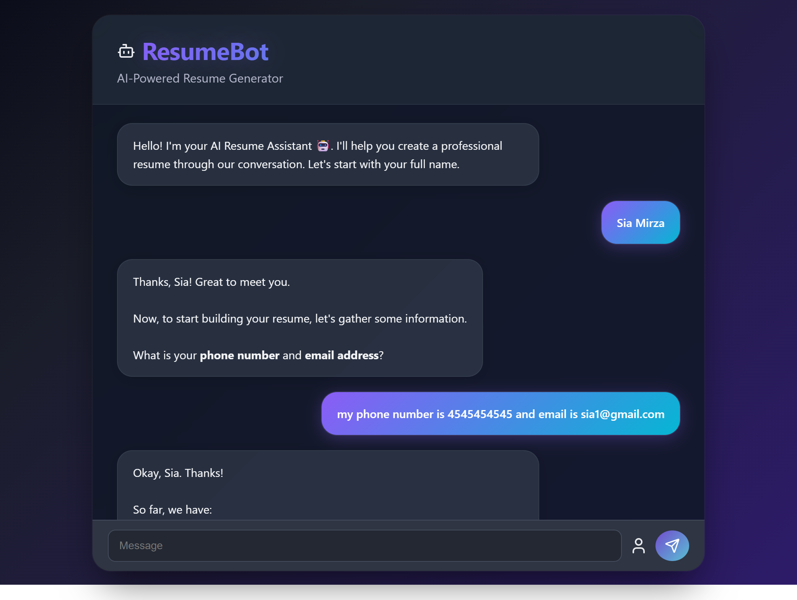

# ResumeBot 

**AI-Powered Resume Generator using Gemini API**

ResumeBot is a smart and intuitive resume builder that collects user information through a **chat-based interface** and generates a **clean, ATS-friendly resume** in your preferred format (Markdown or LaTeX). Built with modern frontend tools and powered by Google's **Gemini API**, it simplifies the resume-making process into a conversation.



---

## ✨ Features

-  AI Resume Assistant using Gemini API
-  Conversational form input via chatbot
-  Supports output in **Markdown** or **LaTeX**
-  Generates resumes that are **ATS-friendly**
-  Clean UI with modern design

---

## 🚀 How It Works

1. User chats with the ResumeBot to provide basic details (name, email, phone, skills, projects, etc.)
2. The bot sends the structured prompt to Gemini API to generate the resume content.
3. The user selects the desired format (Markdown or LaTeX).
4. Just copy the generated resume and convert it to PDF using any free online converter.
> 💡 *Future Goal:* Enable one-click PDF download directly from the app.

---

## 🛠️ Tech Stack

- **Frontend**: React.js, Tailwind CSS
- **AI Integration**: Gemini API
- **State Management**: useState, useEffect, useRef (React Hooks)

---

## 📦 Installation

```bash
git clone https://github.com/Khushi256/ResumeBot.git
cd ResumeBot
npm install
npm install axios html2canvas jspdf
npm run dev
```
---

## 🌐 Deployment

This is a **frontend-only project**, deployed using **Vercel**.
Vercel made the deployment process extremely fast and simple — with just a few clicks and no configuration, the app was live within seconds.

You can view the live project here:  
👉 [https://resume-bot.vercel.app/](https://resume-bot.vercel.app/)

---

## 🤝 Contributing

Feel free to fork this repo, make improvements, and submit a pull request. All contributions are welcome!

---

## 📄 License

Licensed under the [MIT License](LICENSE) — free to use, modify, and distribute.
